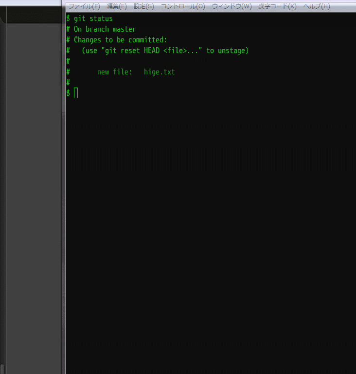

# Sublme Text2 / git_commit_snippets
## Descriptions
Sublime Text2 snippets for 'git commit message (first line. emoji format)'

## Formats

:new: Add: summary  
:bug: Fix: summary  
:hammer: Modify: summary  
:recycle: Refactor: summary  
:computer: Tool: summary  
:x: Remove: summary  

## Usage
Copy `./snippets` to your `%SublimeText%Packages/User` directory.

## Demo

